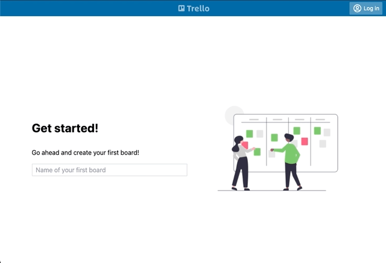

## Trello clone app written in Vue 3 + Typescript + Vite + TailwindCSS

 

    

## Trello clone app
Bundled within the repo is an app that is a clone of a popular [Trello app](https://trello.com). You can create boards, lists and cards. You can drag and drop cards between tests or even upload a picture to the card detail. There’s also a very simple signup and login which will allow you to create private boards

### Installation
Super simple
1. `npm install`
2. `npm start`
3. Open your browser on `http://localhost:3000`

### Database
The application uses a json file for a database which you can find in `trelloapp/backend/data/database.json`. Uploaded files are in `trelloapp/backend/data/uploaded` folder.

### Application utilities
By typing `F2` key in the application, a small toolset appears that will allow you to reset your application to a desired state. You can delete boards, lists, cards, users or everything. This is useful when playing with the application manually.
